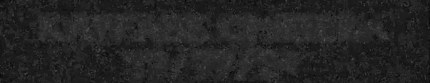
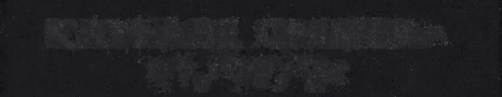
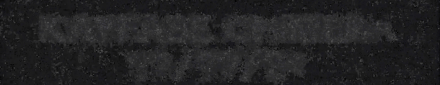

# Analyse de la vidéo teaser

Ce projet analyse les frames d'une vidéo teaser postée sur Twitter par Ptite Soeur et Gemroz, pour décrypter un message caché. 

**Frame random**

**Image Finale**

Méthode 1: Garder les pixels les plus lumineux

|           Frames twitter            |           Frames instagram            |         Frames des deux          |
| :---------------------------------: | :-----------------------------------: | :------------------------------: |
|  |  |  |

Méthode 2: Garder les pixels les plus lumineux ou sombres en fonction de leur luminosité

|           Frames twitter            |           Frames instagram            |         Frames des deux          |
| :---------------------------------: | :-----------------------------------: | :------------------------------: |
|  |  |  |

Méthode 3: Garder la couleur moyenne de chaque pixel

|           Frames twitter            |           Frames instagram            |         Frames des deux          |
| :---------------------------------: | :-----------------------------------: | :------------------------------: |
|  |  |  |

## Contexte
Ptite Soeur et Gemroz ont posté [un teaser sur Twitter](https://twitter.com/PRXPVNE/status/1800230037611753785). À la fin de la vidéo, un message caché est présent mais indescriptible directement. 

Mon thread twitter expliquant plus en détails [juste ici](https://twitter.com/LenochJ/status/1800313166775427112)

## Méthode
Pour décrypter ce message :
1. Extraction des frames de la fin de la vidéo avec Shotcut.
2. Utilisation de Python et de la librairie PILLOW pour analyser chaque pixel de chaque frame.
3. Conservation uniquement des pixels les plus lumineux.
4. Création d'une seule image lisible en output.

\
\
\
J'ai fait webdeck aussi: https://github.com/Lenochxd/WebDeck \
super projet 👍

\
<a href="https://ko-fi.com/lenoch" target="_blank">
^^